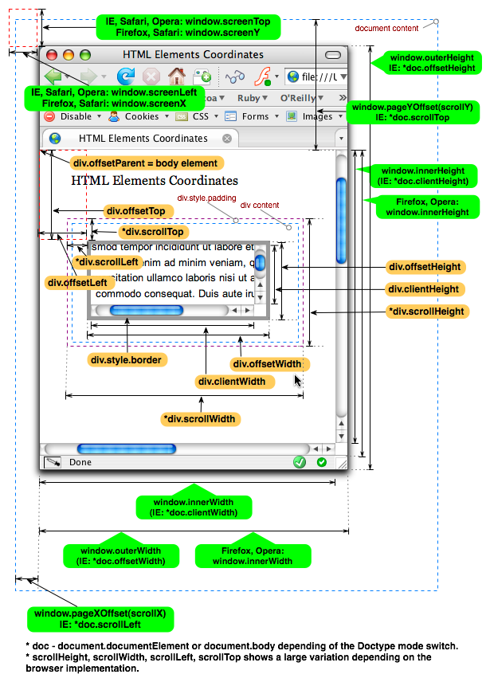

## FED `7/22`

---

### 복습

- DOM Script Design Pattern
- Javascript Core

-

### BOM(Browser Object Model)

- 창 `window`
- 스크린 `screen`
- 웹 브라우저 `navigator`
- 주소 `location`
- 문서 `doucment`

-

#### HTML 요소 좌표 참고 이미지 (크로스 브라우징)
