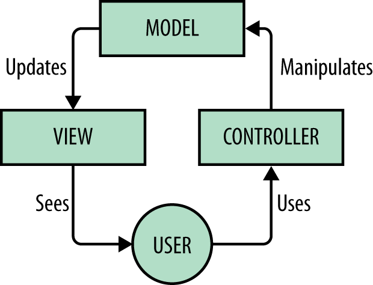

## FED `7/27`

---

### Global Navigation Bar 위젯(컴포넌트) 제작 고려사항

- **<abbr title="Model View Controller">MVC</abbr>** 디자인 패턴 적용
- **Model**: 내비게이션 바 콘텐츠(Data)
- **View**: 화면에 그려질 HTML 구조 + CSS 스타일링
- **Controller**: View 대상에 이벤트 연결, 이벤트 핸들러(함수) 정의

-



-

### DOM Helpers 라이브러리에 신규 함수 추가
```js
/**
 * --------------------------------
 * find() 함수
 * 전달된 첫번째 인자(부모 요소노드)에서
 * 자손(CSS 선택자) 요소노드를 찾는 함수
 * --------------------------------
 */
function find(parentEl, childSelector) {
	var children     = parentEl.querySelectorAll(childSelector),
		children_len = children.length;

	if (children_len === 0) {
		return null;
	} else if ( children_len === 1 ) {
		return children[0];
	} else {
		return children;
	}
}
```