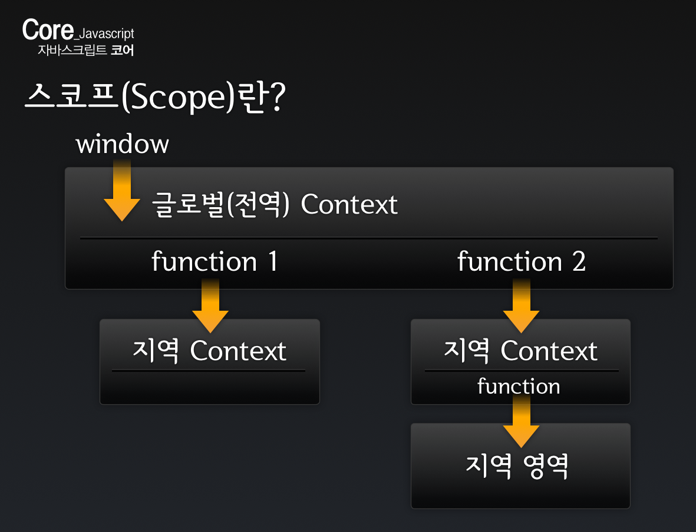

## FED `7/29`

---

### 이벤트 핸들러 연결 및 제거

이벤트를 제거할 때는 `null`을 대입.

```js
document.onclick = function() {
	console.log('1회 실행 이벤트 One Event');
	this.onclick = null;
}
```

-

### parseInt() vs parseFloat()

단위를 뺀 숫자를 반환하는 점은 동일하나, 그 값이 **정수(Integer)**냐, **실수**냐의 차이.

```js
var body_h = window.getComputedStyle( document.body ).height;
var parse_body_h = parseInt(body_h); // 정수 반환
```

-

### **Scope(영역)** & **Hoist(끌어 올림)**

#### 스코프란?

> **코드가 실행되는 영역**을 말한다.



#### 호이스트란?

> **`var`, `function` 키워드를 가진 문장이 영역 최상단으로 끌어올려지는 것**을 말한다.

```js
/**
 * --------------------------------
 * Scope, Hoist
 * 영역, 끌어올리다.
 *
 * 호이스트란?
 * var, function  키워드를 가진 문장이 영역 최상단으로 끌어올려지는 것을 말한다.
 *
 * debugger
 * 중단점(개발도구 Breakpoint)
 * 가급적 도구에서 사용할 것.
 * 코드 내에 삽입하지 말 것.
 * --------------------------------
 */

// 전역(Global Scope)
// 변수, 함수 선언

// fn1(); // hoist 현상으로 오류가 발생한다.

fn2();

// 함수 표현식(Function Expression)
var fn1 = function() { console.log('this is fn1 function.'); };

// fn1(); // 정상 수행된다.

// 함수 선언식(Function Declaration)
function fn2() {
	console.log('this is fn2 function.');
}


/**
 * --------------------------------
 * Scope
 * Global vs Local
 * --------------------------------
 */

// 전역 공간 - window

function localScope() {
	// 지역 공간 - 함수 내부

	function inLocalScope() {
		// 지역 내부의 지역 공간 - 함수 내부의 함수 공간

	}

}
```

### 호이스트로 인한 코드 결과 예측(해석) 오류가 생기는 예

```js
/**
 * --------------------------------
 * Scope
 * Global vs Local
 * --------------------------------
 */

// 전역 공간 - window
var memory = '김치찌개';

localScope();

function localScope() {
	// 지역 공간 - 함수 내부

	// var memory; // 지역 변수 memory는 호이스트 됨. undefined

	if (memory)  { // 지역 변수 memory는 undefined이기에 if 조건문은 실행되지 않음.
		var memory = '된장찌개';
	}

	console.log(memory);  // 지역 변수 memory 값 출력 undefined

	function inLocalScope() {
		// 지역 내부의 지역 공간 - 함수 내부의 함수 공간

	}

}

console.log(memory); // 전역 변수 '김치찌개' 출력
```